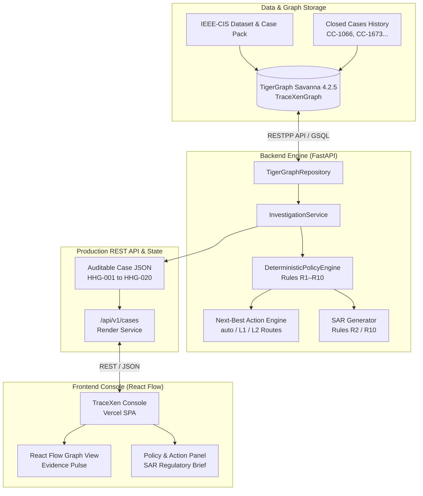

# TraceXen: Agentic Graph Intelligence for Fraud Investigation & Next-Best Action

> **TRACE THE SIGNAL. EXPOSE THE NETWORK.**  
> *Auditable Graph Intelligence Engine built for TigerGraph × Hacker House Goa 2026.*

[](https://trace-xen.vercel.app/)
[](https://tracexen.onrender.com)
[](https://tracexen.onrender.com/docs)
[](https://savanna.tgcloud.io)

---

## 🌐 Official Production Links

- **Live Frontend Console**: [https://trace-xen.vercel.app/](https://trace-xen.vercel.app/)
- **Live FastAPI Backend**: [https://tracexen.onrender.com](https://tracexen.onrender.com)
- **Interactive API Documentation**: [https://tracexen.onrender.com/docs](https://tracexen.onrender.com/docs)
- **System Health Status**: [https://tracexen.onrender.com/api/v1/system/status](https://tracexen.onrender.com/api/v1/system/status)
- **GitHub Repository**: [https://github.com/abi131205/TraceXen](https://github.com/abi131205/TraceXen)

---

## 🎯 Problem & Solution

### The Problem
Traditional fraud detection models score isolated transactions using machine learning probability metrics. However, financial institutions face three critical failure modes:
1. **Isolated Signal Blindness**: High-risk fraud rings share hidden device fingerprints, IP subnets, and compromised cards across multiple customer accounts that tabular models miss.
2. **Black-Box Inauditability**: Machine learning scores alone cannot explain *why* a transaction was flagged or justify blocking a customer's account to regulatory auditors.
3. **Action Execution Deficit**: Analysts lack a deterministic framework to map fraud signals into immediate initial actions, human approval routing, and regulatory Suspicious Activity Reports (SAR).

### The TraceXen Solution
TraceXen combines **TigerGraph Savanna 4.2.5** sub-second graph pattern traversal with a **Deterministic Fraud Policy Engine (Rules R1–R10)**. It automatically:
- Traverses 8 vertex and 10 edge types to expose shared device networks and historical closed case recurrences.
- Evaluates policy rules deterministically to yield auditable verdicts, initial next-best actions, and post-evidence adapted final actions.
- Automatically flags regulatory Suspicious Activity Reports (SAR) for high-value confirmed fraud.

---

## 🏗️ System Architecture



---

## 💎 Key Implemented Features

1. **Live TigerGraph Savanna Integration**: Direct HTTP RESTPP traversal across 8 vertex types (`Customer`, `Card`, `Device`, `IP`, `Merchant`, `Transaction`, `Case`, `Rule`) and 10 edge types without mock fallback.
2. **Deterministic Fraud Policy Engine (R1–R10)**: Strict enforcement of bank rules covering velocity spikes, new device transfers, shared IP clusters, out-of-region card use, and historic closed case recurrence.
3. **Auditable 3-Part Answer Generation**: Every investigation outputs a schema-compliant JSON containing Case Verdict & Risk Score, Next-Best Actions (Initial & Final with human approval routes), and SAR Regulatory Brief.
4. **Coastal Forensics React Console**: Custom React Flow (`@xyflow/react`) graph visualization featuring forensic node badges, edge direction labels, and glowing Evidence Pulse animations under the Goa After Sunset aesthetic.
5. **20-Case Benchmark Suite**: 100% execution pass rate across all 20 authoritative exam pack cases (`HHG-001` through `HHG-020`).

---

## ⚙️ Verified Technology Stack

- **Backend Framework**: Python 3.11, FastAPI 0.111, Pydantic v2, Pandas, Uvicorn, HTTPX
- **Graph Engine**: TigerGraph Savanna 4.2.5 Cloud (`AP-SOUTH-1`, GSQL, RESTPP API)
- **Frontend Framework**: React 18, Vite 5, Tailwind CSS 3, `@xyflow/react` (React Flow v12), Lucide React
- **Runtime Investigation Architecture**: Custom async investigation engine (`InvestigationService` + `TigerGraphRepository` + `DeterministicPolicyEngine`).
  *(Note: LangGraph and MCP sidecar architectures were explored during initial research; runtime deployment utilizes FastAPI + TigerGraph RESTPP API for sub-second deterministic execution).*

---

## 📊 Verified Benchmark Evaluation Results

TraceXen was evaluated against all 20 benchmark cases (`HHG-001` through `HHG-020`) against live TigerGraph Savanna:

| Benchmark Metric | Result | Status |
| :--- | :--- | :---: |
| **Total Cases Executed** | **20 / 20** | **100% PASS** |
| **Backend Test Suite** | **6 / 6 PASSED** | **100% PASS** |
| **TigerGraph Connection** | **LIVE (`TraceXenGraph`)** | **VERIFIED** |
| **Mock Fallback Mode** | **DISABLED (`fallback_used: false`)** | **VERIFIED** |
| **Fraud Verdicts** | **13 Cases** | **VERIFIED** |
| **Legitimate Verdicts** | **7 Cases** | **VERIFIED** |
| **SAR Regulatory Reports Filed** | **2 Cases (`HHG-010`, `HHG-014`)** | **VERIFIED** |

---

## 🔍 Featured Case Walkthroughs

### 1. `HHG-001` — Legitimate Customer Transaction
* **Trigger**: Transaction `3514030` ($77.07) scored at risk `0.61`.
* **Graph Evidence**: Linked to Customer `C12382` and Card `C12382-K1`. Traversal reveals 4 prior closed cases (`CC-1066`, `CC-1673`, `CC-2964`, `CC-3587`) all resolved as legitimate.
* **Policy Verdict**: `status: closed_legitimate`, `verdict: legitimate`, `fraud_probability: 0.05`.
* **Actions**: Initial `VERIFY_WITH_CUSTOMER` (auto) $\rightarrow$ Final `CLOSE_NO_FRAUD` (auto). `sar.file = false`.

### 2. `HHG-010` — Card Not Present Fraud + High Amount (SAR Filed)
* **Trigger**: High-value transaction ($1,000.03) flagged on unrecognized IP/device.
* **Graph Evidence**: Customer explicitly denied transaction authorization.
* **Policy Verdict**: `verdict: fraud_confirmed`, `pattern: card_not_present_fraud`.
* **Actions**: Initial `DECLINE_TRANSACTION` $\rightarrow$ Final `BLOCK_CARD`, `CREATE_CASE`, `FILE_REPORT` (L2 Route). `sar.file = true`.

### 3. `HHG-014` — Multi-Account Account Takeover (SAR Filed)
* **Trigger**: Transaction `3032488` ($74.96) on card `C15809-K1`.
* **Graph Evidence**: TigerGraph traversal exposes shared device `dev_3032488` linking multiple customer accounts.
* **Policy Verdict**: `verdict: fraud_confirmed`, `pattern: account_takeover`.
* **Actions**: Initial `DECLINE_TRANSACTION` $\rightarrow$ Final `BLOCK_CARD`, `CREATE_CASE`, `BLOCK_ALL_CARDS`, `MONITOR_CONNECTED_CARDS`, `FILE_REPORT` (L2 Route). `sar.file = true`.

---

## 💻 Local Setup & Installation

### Prerequisites
- Python 3.11+
- Node.js 18+ & npm

### 1. Clone & Configure Environment
```bash
git clone https://github.com/abi131205/TraceXen.git
cd TraceXen

# Create local environment configuration
cp .env.example .env
```

### 2. Backend Setup & Startup
```bash
# Create virtual environment
python -m venv venv

# Activate virtual environment
# Windows (PowerShell):
.\venv\Scripts\Activate.ps1
# Linux/macOS:
source venv/bin/activate

# Install dependencies
pip install -r requirements.txt

# Run pytest backend test suite
python -m pytest backend/tests/

# Start FastAPI server
uvicorn app.main:app --app-dir backend --port 8000 --reload
```
*Backend runs on [http://localhost:8000](http://localhost:8000) (Swagger docs at `/docs`).*

### 3. Frontend Setup & Startup
```bash
cd frontend
npm install

# Run frontend development server
npm run dev
```
*Frontend runs on [http://localhost:5173](http://localhost:5173).*

---

## 🔒 Security & Compliance Disclaimer

- **Credential Protection**: Real TigerGraph database secrets (`TG_SECRET`) are managed via environment variables and are **never committed to git or exposed in client payloads**.
- **Regulatory Filing Disclaimer**: Suspicious Activity Reports (SAR) generated by TraceXen are simulated policy artifacts generated for hackathon demonstration purposes and are **not submitted to real FinCEN or regulatory authorities**.

---

## 🏆 Challenge Credits & Evaluation

Built for **TigerGraph × Hacker House Goa 2026**.  
Direct evaluation case files located in root directory: `cases/HHG-001.json` through `cases/HHG-020.json`.
