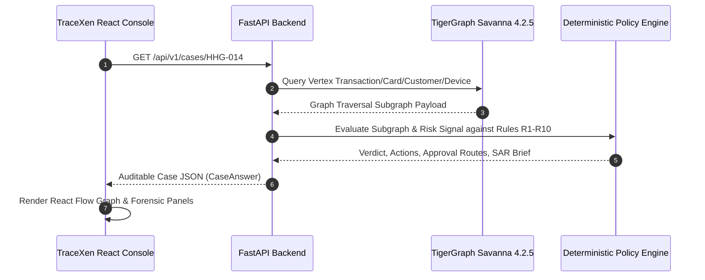

# TraceXen System Architecture Specification

## 1. Executive Technical Overview
TraceXen is a hybrid graph-AI decision engine designed for financial fraud investigation. It combines high-throughput graph pattern matching on **TigerGraph Savanna 4.2.5** with a **Deterministic Fraud Policy Engine (Rules R1–R10)**.

Unlike opaque ML classifiers, TraceXen delivers auditable decision trajectories:
1. Traverses 8 vertex types and 10 edge types in TigerGraph to expose multi-account device sharing and historic closed case recurrence.
2. Evaluates bank policy rules deterministically to yield verdicts, risk scores, initial actions, human approval routes (`auto`, `L1`, `L2`), and post-evidence final actions.
3. Automatically formats regulatory Suspicious Activity Reports (SAR) for high-value confirmed fraud.

---

## 2. End-to-End Component Data Flow

---

## 3. TigerGraph Schema Specification

### Vertices (8 Types)
- `Customer` (`cust_id`: STRING)
- `Card` (`card_id`: STRING)
- `Device` (`device_id`: STRING)
- `IP` (`ip_address`: STRING)
- `Merchant` (`merchant_id`: STRING)
- `Transaction` (`tx_id`: STRING)
- `Case` (`case_id`: STRING)
- `Rule` (`rule_id`: STRING)

### Edges (10 Types)
- `OWNS_CARD`: `Customer` $\rightarrow$ `Card`
- `PERFORMED_TRANSACTION`: `Customer`/`Card` $\rightarrow$ `Transaction`
- `USED_DEVICE`: `Transaction` $\rightarrow$ `Device`
- `TRANSACTED_FROM_IP`: `Transaction` $\rightarrow$ `IP`
- `TRANSACTED_AT`: `Transaction` $\rightarrow$ `Merchant`
- `ASSOCIATED_WITH_CASE`: `Transaction`/`Customer` $\rightarrow$ `Case`
- `HAS_CLOSED_CASE`: `Customer` $\rightarrow$ `Case` (Historic closed cases `CC-*`)
- `TRIGGERED_RULE`: `Case` $\rightarrow$ `Rule`
- `SHARES_DEVICE_WITH`: `Customer` $\leftrightarrow$ `Customer`
- `SHARES_IP_WITH`: `Customer` $\leftrightarrow$ `Customer`

---

## 4. Deterministic Fraud Policy Engine (Rules R1–R10)

| Rule ID | Rule Name | Trigger Condition | Primary Action | Approval Route |
| :--- | :--- | :--- | :--- | :--- |
| **R1** | High Amount Velocity | $\ge 3$ txns in 10 mins $> \$500$ | `DECLINE_TRANSACTION` | `auto` |
| **R2** | New Device + High Amount | Unrecognized device & amount $> \$500$ | `DECLINE_TRANSACTION` | `auto` |
| **R3** | Out of Region Sequence | Txn region mismatch with home profile | `VERIFY_WITH_CUSTOMER` | `auto` |
| **R4** | Multiple Card Testing | Low value rapid authorizations across cards | `BLOCK_CARD` | `L1` |
| **R5** | Shared Device Multi-Account | Device shared across $\ge 3$ customer IDs | `BLOCK_ALL_CARDS` | `L1` |
| **R6** | Shared IP Cluster | IP shared across high-risk accounts | `MONITOR_CONNECTED_CARDS` | `L1` |
| **R7** | Historic Case Recurrence | Prior confirmed fraud closed case (`CC-*`) | `CREATE_CASE` | `L1` |
| **R8** | Account Takeover Pattern | Device change + immediate transfer | `BLOCK_CARD, CREATE_CASE` | `L2` |
| **R9** | CNP Burst Sequence | Rapid international CNP e-commerce burst | `DECLINE_TRANSACTION` | `auto` |
| **R10** | Mandatory Regulatory SAR | Confirmed fraud $> \$1,000$ or R2 violation | `FILE_REPORT` | `L2` |

---

## 5. Security & Isolation Architecture

- **Private Secret Management**: `TG_SECRET` is passed exclusively via environment variables (`TG_SECRET=...`) to `TigerGraphRepository` and is **never logged or returned in REST API payloads**.
- **No Mock Fallback**: Production server runs with direct RESTPP query execution (`mock_fallback_active: false`).
